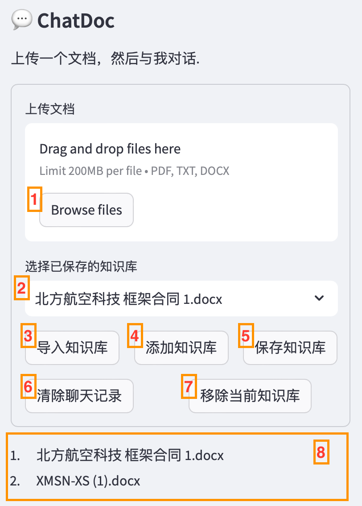

# ChatDoc

这个项目是基于[ChatGLM2-TPU](https://github.com/sophgo/ChatGLM2-TPU)实现的文档对话工具。项目可在BM1684X上独立部署运行。


## Introduction
该项目的主要目标是通过使用自然语言来简化与文档的交互，并提取有价值的信息。此项目使用LangChain和ChatGLM2构建，以向用户提供流畅自然的对话体验。


## Features

- 支持多种文档格式PDF, DOCX, PPTX, TXT等。
- 与文档内容进行聊天，提出问题根据文档获得相关答案。
- 用户友好的界面，确保流畅的交互。

## Architecture


## Installation

按照以下步骤，可以将这个项目部署到SoPhGo盒子上。

1. 克隆代码:
```bash
git clone https://github.com/zhengorange/chatdoc
```
2. 进入项目路径:
```bash
cd chatdoc
```
3. 按照依赖
```bash
pip install -r requirements.txt
```

## Configuration

项目加载需要配置两个模型文件的地址和一个库文件地址。

```ini
libtpuchat_path = ../chatglm/libtpuchat.so
bmodel_path = ../chatglm/chatglm2-6b.bmodel
token_path = ../chatglm/tokenizer.model
```

## Usage: Web by Streamlit


```bash
bash run.sh
```

## 操作流程介绍



* 进入程序后有两种方式去选择要对话的文档。第一种是上传文档，具体做法是点击`1`选择要上传的文档，然后点击按钮`4`构建知识库。第二种是选择选择已持久化的知识库，具体做法是从选择框
`2`选择一个知识库，然后点击按钮`3`导入知识库。

* 选择框`2`是已持久化的向量库，向量库的名称一般是由此向量库内文档名以逗号连接命令。

* 展示区`8`是当前ChatDoc选中的文档列表，即表示对话过程中ChatDoc参考的文档范围。

* 点击按钮`6`可以清空当前的聊天记录。
* 点击按钮`7`可清空聊天记录并清空ChatDoc选中的文档。若要继续使用ChatDoc，可以上传文档或选中已持久化的知识库导入。
* 已持久化的知识库可以增量添加新的文档。具体做法是，导入已持久化知识库后，点击按钮`1`选中要新增的文档，然后点击按钮`4`将文档添加至当前ChatDoc选中列表。
最后点击按钮`5`持久化知识库。